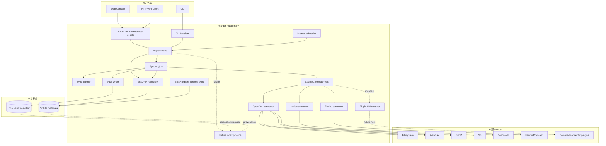
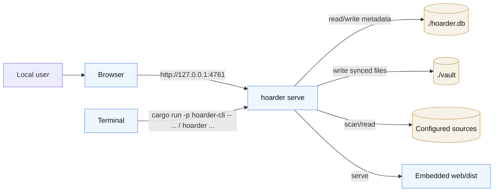
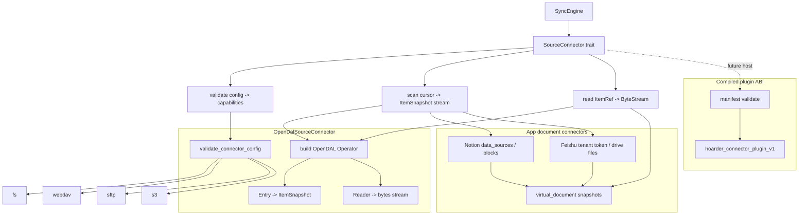
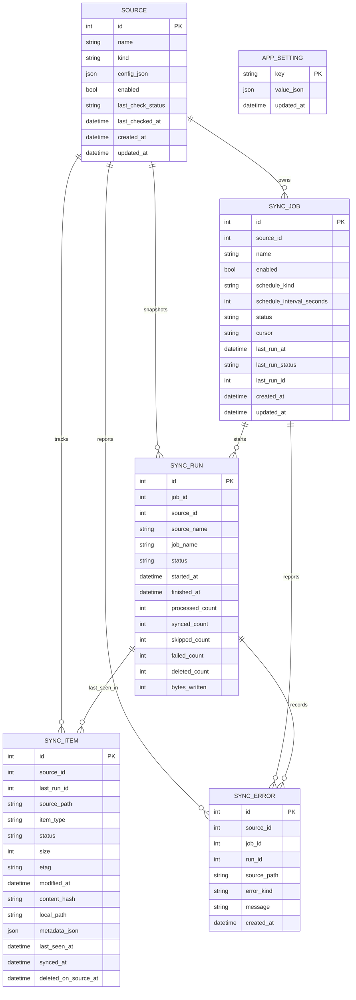
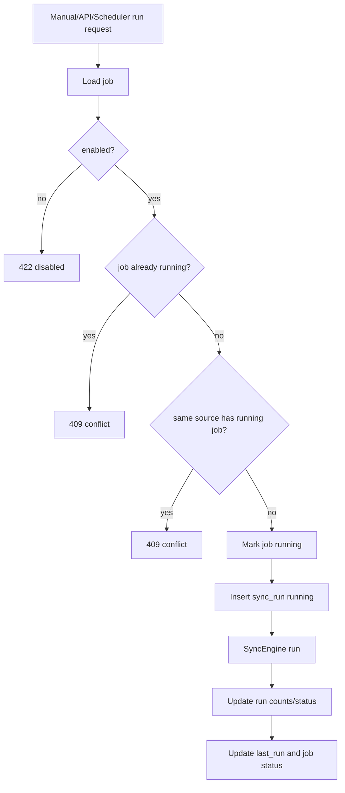
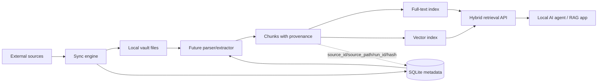

# Hoarder Architecture

日期：2026-05-29
状态：当前实现架构说明
读者：后端工程师、前端工程师、测试与发布负责人、后续维护 agent

## 1. 架构目标

Hoarder 的架构围绕本地优先、单向同步、可审计、可扩展 connector 和 RAG-ready 知识库聚合五个目标组织：

- Interface 层只负责 CLI/HTTP/Web 交互，不承载同步业务逻辑。
- App services 编排 source、job、run、settings 等业务流程，供 CLI 与 API 复用。
- Sync runtime 只关心扫描、计划、写入和记录结果，不知道 HTTP、CLI 或 Svelte。
- Connector trait 输出 Hoarder 领域模型，避免 OpenDAL 类型泄漏进同步核心；connector 只 validate、scan 和 read source，不提供修改 source 的能力。
- SQLite 记录 metadata，vault 保存用户可直接读取的文件。
- 后续 AI/RAG 能力应建立在 vault 与 metadata 之上，通过独立 index pipeline 保留 source provenance，而不是污染同步主路径。

## 2. 总体架构图



## 3. 部署视图

当前部署模型是单进程、本地优先、单用户默认。



关键默认值：

- API 与 Web 控制台默认监听 `127.0.0.1:4761`。
- 数据库默认 `./hoarder.db`。
- vault 默认 `./vault`。
- job 并发默认 `1`，file 并发默认 `4`。

## 4. 分层职责

| 层 | 主要目录 | 职责 | 不应做的事 |
| --- | --- | --- | --- |
| Interface | `crates/hoarder-cli/`、`crates/hoarder-server/src/api/`、`web/src/` | 参数解析、request/response、页面状态与交互 | 不直接实现同步业务规则 |
| App services | `crates/hoarder-server/src/app/` | source/job/run/settings 编排，复用业务流程 | 不直接写 SQL 或处理 HTTP 细节 |
| Sync runtime | `crates/hoarder-sync/` | scan、plan、read、write、record run/item/error | 不知道 Axum、CLI、Svelte 或具体 UI |
| Connector | `crates/hoarder-connectors/` | 连接器 trait、OpenDAL 实现、配置校验、capability | 不写入 vault，不决定 item 是否同步 |
| Persistence | `crates/hoarder-server/src/db/`、`crates/hoarder-server/src/entity/` | SeaORM entities、repository、schema sync | 不编码产品流程 |
| Core domain | `crates/hoarder-core/` | ID、状态枚举、snapshot、vault path 安全规则 | 不依赖 Web/API/数据库实现 |
| Packaging | `crates/hoarder-server/src/server.rs`、`crates/hoarder-server/src/assets.rs` | Axum app 组装、静态资产嵌入、server 生命周期 | 不改变业务语义 |
| Future AI/RAG | 后续模块 | 文件解析、chunk、embedding、全文/向量索引、RAG retrieval API | 不阻塞或改变基础 sync run 语义 |

## 5. 模块地图

| 模块 | 说明 |
| --- | --- |
| `crates/hoarder-cli/src/main.rs` | binary 入口 |
| `crates/hoarder-cli/src/cli.rs` | Clap 命令定义与 CLI handler |
| `crates/hoarder-server/src/server.rs` | 加载配置、连接 SQLite、schema sync、启动 scheduler 和 Axum |
| `crates/hoarder-server/src/api/routes.rs` | API route 定义，调用 app services |
| `crates/hoarder-server/src/api/types.rs` | API DTO 和 query/request/response 类型 |
| `crates/hoarder-server/src/app/source_service.rs` | source 创建、更新、列表、测试 |
| `crates/hoarder-server/src/app/job_service.rs` | job 创建、更新、列表、手动 run、运行互斥 |
| `crates/hoarder-server/src/app/run_service.rs` | run、item、error 查询 |
| `crates/hoarder-server/src/app/settings_service.rs` | runtime settings 读取和更新 |
| `crates/hoarder-server/src/app/scheduler.rs` | serve 模式固定间隔调度 |
| `crates/hoarder-sync/src/engine.rs` | 同步执行器，处理 run 生命周期和 item 结果 |
| `crates/hoarder-sync/src/planner.rs` | 变更判断：sync、skip、mark deleted |
| `crates/hoarder-sync/src/vault_writer.rs` | 安全路径、临时写入、hash、原子替换 |
| `crates/hoarder-connectors/src/traits.rs` | connector 公共接口和 config enum |
| `crates/hoarder-connectors/src/opendal/` | OpenDAL fs/webdav/sftp/s3 配置校验、operator、scan、read |
| `crates/hoarder-connectors/src/notion.rs` | Notion data source/page 虚拟文档扫描、分页 cursor、读取 JSON 文档 |
| `crates/hoarder-connectors/src/feishu.rs` | 飞书 tenant token、Drive folder 分页扫描、引用型 JSON 文档读取 |
| `crates/hoarder-connectors/src/plugin.rs` | 第三方编译 connector ABI 常量、manifest、配置 schema 和 secret field 契约 |
| `crates/hoarder-server/src/db/repository.rs` | SeaORM repository，实现 source/job/settings/sync repository traits |
| `web/src/` | Svelte 5 控制台：Overview、Sources、Jobs、Runs、Settings |

## 6. Connector 架构



Connector contract：

```text
SourceConnector
  - kind() -> ConnectorKind
  - validate(config) -> ConnectorCapabilities
  - scan(config, cursor) -> stream<ItemSnapshot>
  - read(config, item_ref) -> stream<Bytes>
```

这个 contract 是单向 source-to-vault 边界：connector 可以读取 source 元数据与内容，但不能通过 Hoarder 写入或修改 source。

`ItemSnapshot` 是同步核心的最小公共模型：`source_id`、`source_path`、`item_type`、`size`、`etag`、`modified_at`、`content_hash`、`metadata_json`。

## 7. 数据模型



说明：当前 SQLite schema 使用普通引用列保存 `source_id`、`job_id`、`run_id` 等关系，repository 层负责必要的实时引用校验。`sync_run` 保存 `source_name` 和 `job_name` 快照，确保历史记录在 source/job 后续改名后仍可读。

## 8. API 边界

| Endpoint | 用途 | Service |
| --- | --- | --- |
| `GET /api/health` | 健康检查 | route local |
| `GET /api/openapi.json` | OpenAPI specification | `api::openapi` |
| `GET /api/sources` | source 列表 | `source_service::list_sources` |
| `POST /api/sources` | 创建 source | `source_service::create_source` |
| `PATCH /api/sources/{id}` | 更新 source | `source_service::update_source` |
| `POST /api/sources/{id}/test` | 测试 source | `source_service::test_source` |
| `GET /api/jobs` | job 列表 | `job_service::list_jobs` |
| `POST /api/jobs` | 创建 job | `job_service::create_job` |
| `PATCH /api/jobs/{id}` | 更新 job | `job_service::update_job` |
| `POST /api/jobs/{id}/run` | 运行 job | `job_service::run_job` |
| `GET /api/runs` | run 列表 | `run_service::list_runs` |
| `GET /api/runs/{id}` | run 详情 | `run_service::get_run_detail` |
| `GET /api/items` | item 查询 | `run_service::list_items` |
| `GET /api/errors` | error 查询 | `run_service::list_errors` |
| `GET /api/settings` | settings 读取 | `settings_service::get_settings` |
| `PATCH /api/settings` | settings 更新 | `settings_service::update_settings` |

所有 API 错误统一为：

```json
{
  "error": {
    "code": "VALIDATION_ERROR",
    "message": "invalid JSON body"
  }
}
```

## 9. 控制与并发



并发规则：

- 同一个 job 不能重复运行。
- 同一个 source 不能同时运行多个 job。
- Scheduler 每 30 秒 tick，一次最多启动 `job_concurrency` 个到期 interval jobs。
- 文件处理通过 `file_concurrency` 限制 pending item 数量。

## 10. 安全边界

| 风险 | 当前防护 |
| --- | --- |
| 远程暴露本地 API | 默认监听 `127.0.0.1` |
| 浏览器跨源调用 | CORS 只允许 localhost/127.0.0.1/[::1] 和开发/生产端口 |
| secret 泄露 | API DTO 和 connector config 对 password、token、key、secret 等字段脱敏 |
| 路径穿越 | `normalize_source_path` 拒绝绝对路径、`..`、NUL、Windows drive prefix |
| 覆盖内部目录 | source path 首段为 `.hoarder` 时拒绝写入 |
| 部分写入 | 文件先写入 `.hoarder/tmp`，成功后 rename 到目标路径 |
| 内部错误暴露 | API 将 database/io 映射为通用 `INTERNAL_ERROR` |

## 11. AI/RAG 知识库扩展架构

Hoarder 当前已经提供 RAG 数据准备层需要的三类基础资产：可读 vault 文件、可查询 metadata、可审计 run/error 历史。后续 RAG 能力应以独立 pipeline 追加，而不是直接塞进 `SyncEngine`。



设计约束：

- Sync run 的职责仍然是可靠同步和记录状态；解析和索引失败不应改变文件同步结果。
- 每个 chunk 必须保留 `source_id`、`source_path`、`local_path`、`content_hash`、`last_run_id` 等 provenance。
- Index pipeline 可以根据 `sync_item.updated_at`、`content_hash` 或 run id 增量处理。
- Full-text search、vector search 和 RAG serving 应以可替换组件设计，避免过早绑定某个向量数据库或 embedding provider。
- 本地优先仍是默认安全边界；任何 LLM/embedding 外部调用都必须显式配置。

## 12. 扩展点

| 扩展方向 | 推荐切入点 |
| --- | --- |
| 新 storage connector | 在 `ConnectorConfig` 与 `SourceConnector` 实现中增加 service 或 kind |
| 应用类 connector | 将页面/文档映射为 `ItemType::VirtualDocument`，由 `read` 输出导出内容 |
| 增量扫描 | 使用 `sync_job.cursor` 和 `scan(config, cursor)` 参数，扩展 run 完成后的 cursor 持久化 |
| 重试策略 | 在 `SyncEngine::process_snapshot` 和 connector-level scan/read 周围加入 bounded retry |
| 搜索与 RAG | 基于 `sync_item.local_path`、hash 和 provenance 建立独立解析/chunk/index/retrieval pipeline，不阻塞同步主路径 |
| 远程多用户 | 需要先引入认证、授权、CSRF/CORS 重新设计和跨进程 job lock |

## 13. 质量门禁

后端变更：

```bash
cargo fmt --check
cargo clippy --workspace --all-targets --all-features --message-format=short
cargo test --workspace
```

前端变更：

```bash
cd web
bun run verify
```

打包变更：

```bash
cd web
bun run build
cd ..
cargo build -p hoarder-cli --release
```
