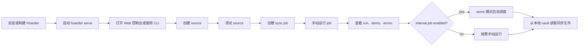
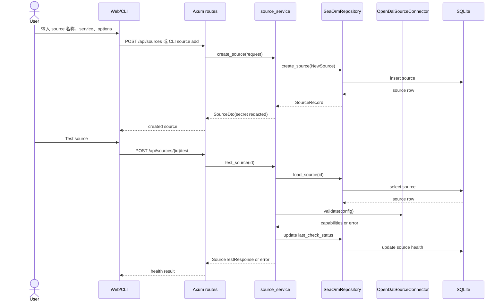
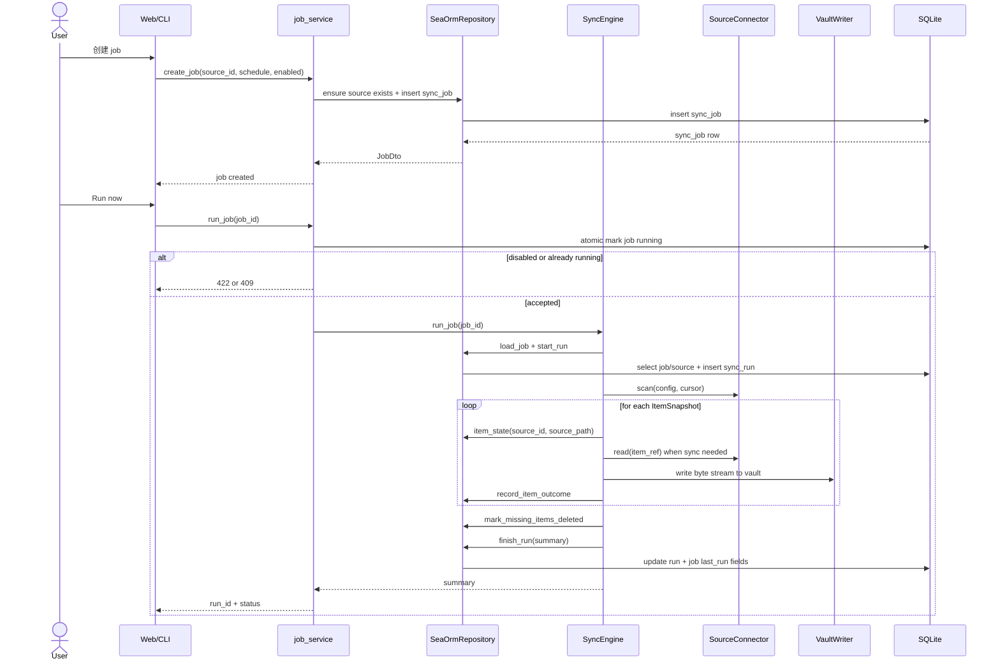
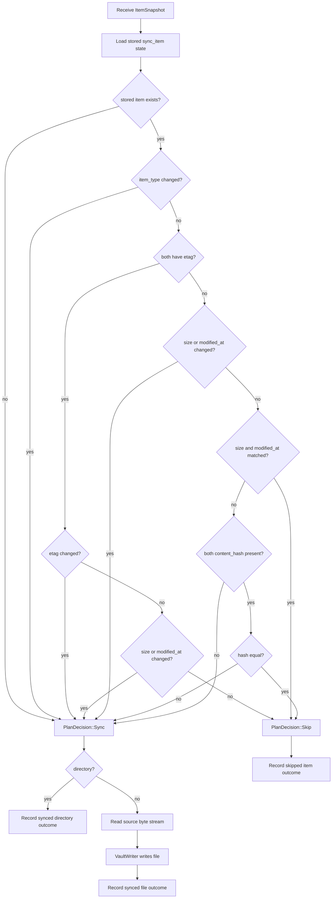
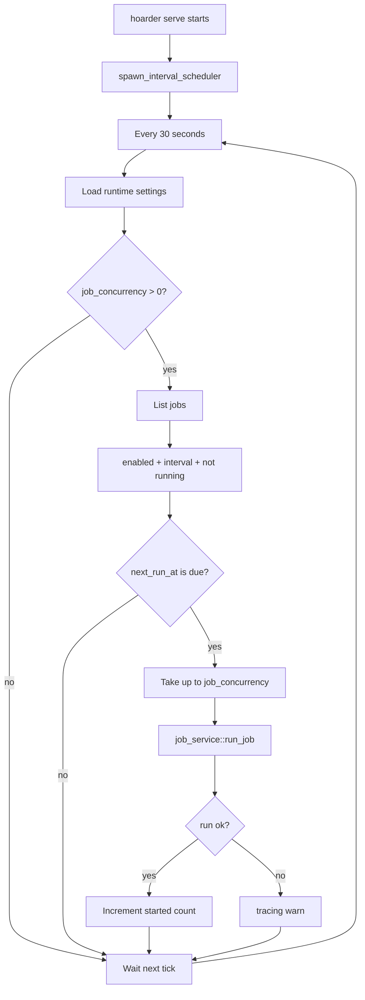
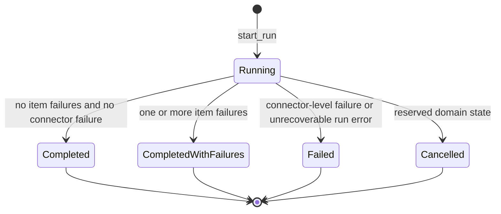
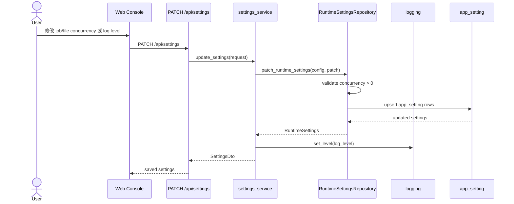
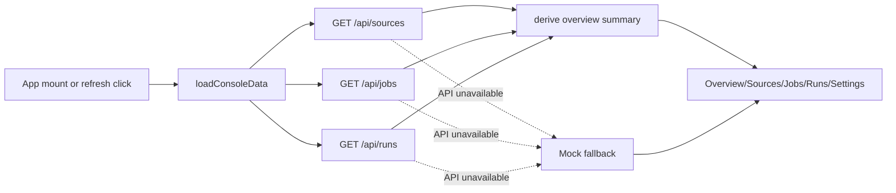
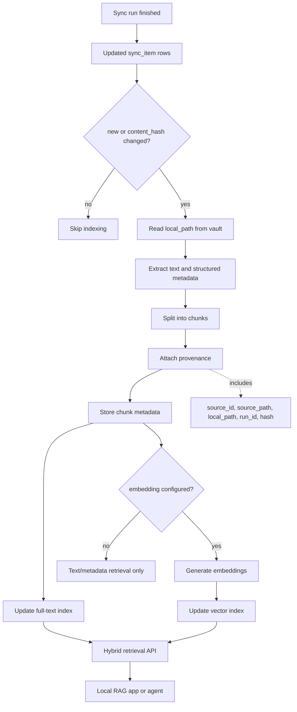

# Hoarder Flows

日期：2026-05-29
状态：当前产品与技术流程说明
读者：产品负责人、工程师、测试负责人、后续维护 agent

## 1. 产品主流程



产品判断点：

- Source 未测试也可以保存，但 UI 应提示健康状态为 `untested`。
- Job 被禁用时不允许运行，展示为 paused/disabled 语义。
- Run 失败后用户应能从 run detail 进入 error 和 item 视图定位问题。

## 2. Source 创建与测试流程



技术要点：

- API 返回的 connector config 必须脱敏。
- 更新 source 时，如果用户提交的是 redacted secret，占位值会合并回已有 secret。
- `validate` 当前返回 capability，不写入 vault，也不启动 sync。

## 3. Job 创建与手动运行流程



产品要点：

- 手动 run 与 scheduler run 使用同一条业务路径。
- Run 成功但有 item 失败时，run 状态是 `completed_with_failures`，用户仍可审计已成功同步的 item。
- Connector 级失败会使整个 run 失败。

## 4. 同步引擎 item 决策流程



源端删除不在单个 snapshot 决策中完成，而是在 scan 结束后统一执行：当前 run 没有看到、且此前未标记删除的同 source item，会被标记为 `deleted_on_source`。

## 5. Vault 写入流程

```mermaid
flowchart TD
    ItemRef[ItemRef source_id + source_path] --> Normalize[normalize_source_path]
    Normalize --> PathValid{path safe?}
    PathValid -- no --> PathError[return AppError::Path]
    PathValid -- yes --> Target[Build vault/{source_id}/normalized/path]
    Target --> Temp[Build vault/.hoarder/tmp/{uuid}-{leaf}.tmp]
    Temp --> Mkdir[Create parent directories]
    Mkdir --> Stream[Stream chunks from connector]
    Stream --> Hash[Update SHA-256 and byte count]
    Hash --> Flush[Flush temp file]
    Flush --> Rename[Atomic rename temp -> target]
    Rename --> Outcome[VaultWrite target_path + hash + bytes]
    Stream -. any error .-> Cleanup[Remove temp file best-effort]
    Cleanup --> Error[Return error]
```

安全规则：

- 空路径、绝对路径、路径穿越、NUL、Windows drive prefix 均拒绝。
- source path 第一段为 `.hoarder` 时拒绝，避免覆盖内部临时目录。
- 源端消失的文件不会触发本地文件删除。

## 6. Scheduler 流程



当前 scheduler 是单进程设计。它适合本地 `serve` 模式，不提供跨进程 advisory lock 或分布式调度语义。

## 7. Run 状态与错误流程



错误映射：

| 错误类型 | Run 影响 | API 映射 | 持久化 |
| --- | --- | --- | --- |
| JSON/path 提取错误 | 不启动 run | `400 VALIDATION_ERROR` | 无 |
| Source/job/run 不存在 | 不启动 run | `404 NOT_FOUND` | 无 |
| Job 已在运行 | 不启动 run | `409 CONFLICT` | 无 |
| Disabled job | 不启动 run | `422 UNPROCESSABLE_ENTITY` | 无 |
| Item read/write/path 失败 | run 可继续 | run detail 中展示 | `sync_item` + `sync_error` |
| Connector scan/build 失败 | run 失败 | `502 CONNECTOR_ERROR` | `sync_run` 失败摘要 |
| Database/IO 内部错误 | run 或 API 失败 | `500 INTERNAL_ERROR` | 视失败阶段而定 |

## 8. Settings 更新流程



只读启动配置：`database_path`、`vault_path`、`listen_addr` 来自启动配置或 CLI flag，API 会返回但不会通过 runtime settings 修改。

## 9. Web 控制台数据刷新流程



当前前端保留 mock fallback，便于本地 API 不可用时预览控制台。但产品真实状态应以 live API 为准。

## 10. AI/RAG 知识库聚合流程



这个流程是规划中的 RAG 扩展路径。当前 Hoarder 已经提供前半段：source 聚合、vault 写入、metadata、hash、run 和 error 审计。后半段应作为独立 index pipeline 引入，避免同步成功与索引成功互相耦合。

RAG 场景的关键约束：

- Retrieval 返回的每段上下文必须带引用信息，可追溯到 source 和本地文件。
- Index pipeline 应按 hash 或 updated_at 增量处理，避免每次全量重建。
- Embedding provider、vector store 和 LLM gateway 应显式配置，默认保持本地优先和不外发数据。

## 11. 测试流程建议

| 流程 | 推荐验证 |
| --- | --- |
| Source 创建/测试 | API route tests、connector contract tests、source service tests |
| Job 创建/运行 | app service tests、CLI command tests、API route tests |
| Sync engine | `tests/sync_engine.rs`、`tests/sync_planner.rs`、`tests/vault_writer.rs` |
| 本地端到端 | `tests/e2e_local_fs_sync.rs` |
| Schema | `tests/db_schema.rs`、空数据库启动 smoke test |
| Web 控制台 | `cd web && bun run verify`，后续补浏览器截图回归 |
| 打包 | `cd web && bun run build && cargo build --release` |
| RAG 索引扩展 | parser/chunker 单元测试、provenance 保留测试、hash 增量索引测试、外部 embedding 禁用默认值测试 |
